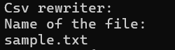
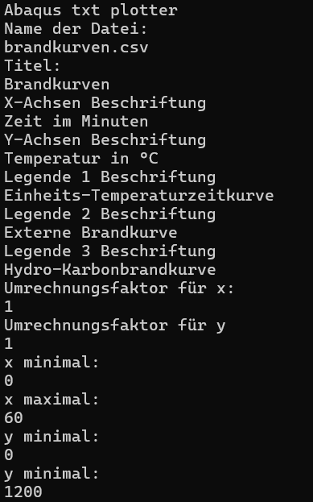
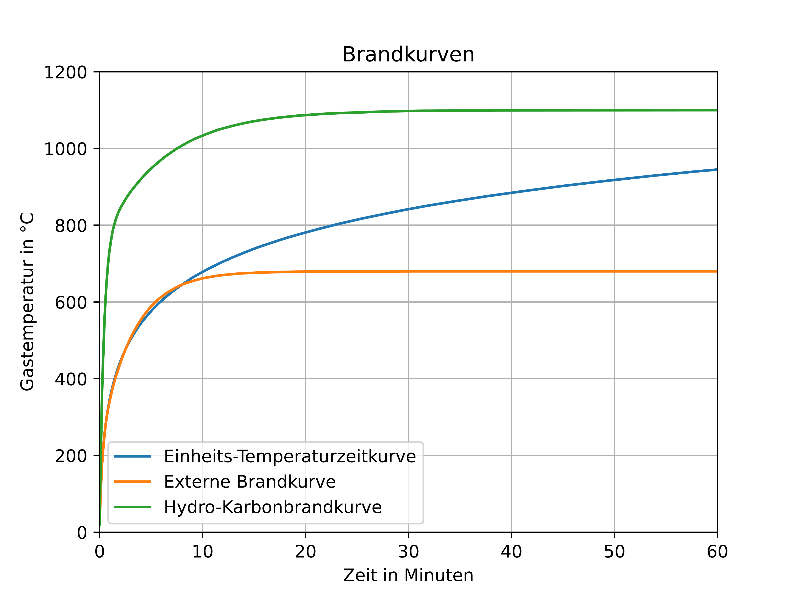
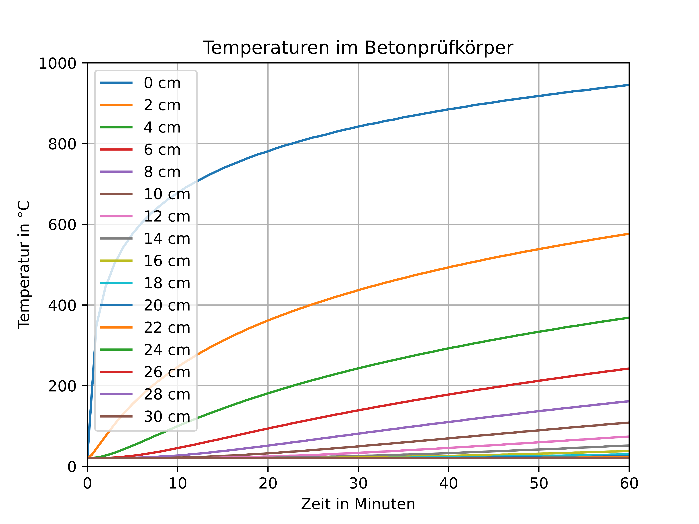
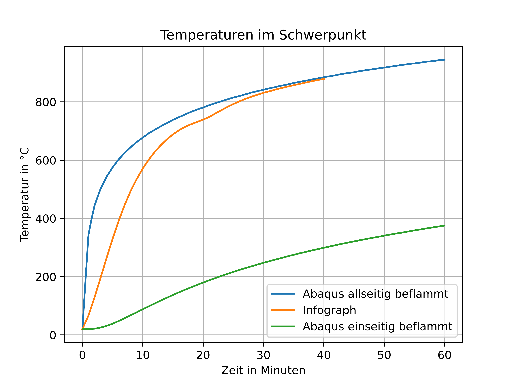

# Csv\_converter and Data\_plotter in Python 

## Python

Um den in diesem Repositorium enhaltenen Code nutzen zu können ist es in erster Linien wichtig Python zu haben.

Python kann dabei entweder über die offizielle Webseite von [Python](https://www.python.org/), über Msys2 oder über Linux Terminal heruntergeladen werden.

Linux: 

```bash
sudo apt install python3
```

Msys2(Windows):

```bash
pacman -S python
```

Wichtig ist es nach der Installation zu überprüfen ob Python richtig installiert wurde und über Terminal erreichbar ist.

## Matplotlib

Matplotlib ist eine bekannte Python-Bibliothek die genutzt werden kann um Plots mit Python zu erstellen. Für die Tools ist es notwendig matplotlib installiert zu haben.

Linux:

```bash
pip install matplotlib
```

oder

```bash
sudo apt install python3-matplotlib
```

Msys2(Windows):

```bash
pacman -S mingw-w64-x86_64-python-matplotlib
```

Natürlich kann auch unter Windows pip für die Installation von Matplotlib benutzt werden.

## Csv converter



*Abbildung 1: Screenshot abaqus_to_csv.py*

In diesem Ordner ist ein Tool welches darauf ausgelegt ist die von Abaqus erhaltenen x,y output Dateien in \*.csv zu convertieren, um diese leichter mit Excel oder LibreOffice verarbeiten zu können.

Um dieses Tool zu nutzen wird im Ordner mit der Zieldatei das Terminal geöffnet und das Tools aufgerufen:

```bash
python abaqus_to_csv.py
```

## File plotter

### Dataplotter xy



*Abbildung 2: Screenshot data_plotter_x3y.py*



*Abbildung 3: Beispielplot mit data_plotter_x3y.py*

In diesem Ordner sind Tools die es ermöglichen mit Matplotlib Datensätze zu plotten. Dabei ist es wichtig, dass die Überschriften der Datensätze in den ersten 2 Zeilen der Datei zu finden sind. Falls die Überschriften in ab der dritten Spalte sind gibt es einen Fehler und die Tools funktionieren nicht!

Die Tools mit der Endung \*x\<zahl\>y.py geben an wie viele y Spalten für ein x in der zu verarbeitenden Datei enthalten sein sollen. Wenn man z.B. eine Datei mit 4 Spalten hat in denen eine als x und 3 als zugehörige y Werte eingetragen sind, so ist das Tool data\_plotter\_x3y.py dafür passend.



*Abbildung 4: Beispielplot mit data_plotter_x16y.py*

### Dataplotter dat


*Abbildung 5: Screenshot data_plotter_3dat.py



*Abbildung 6: Beispielplot mit data_plotter_3dat.py

Die Tools mit der Endung \*\<zahl\>dat.py geben an wie viele Dateien mit je einer x und einer y Spalte verarbeitet werden. Wenn man z.B. 3 Dateien so ist das Tool data\_plotter\_3dat.py dafür passend.


